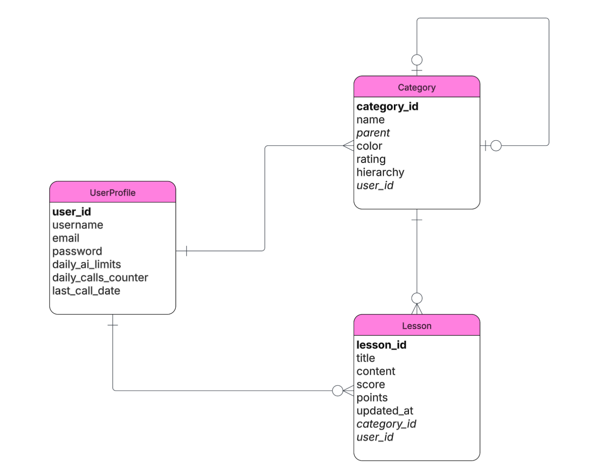

# Personal Knowledge Management App — Backend (Django)

## Overview

This is the backend for PKM — a skill tracking app that uses AI to evaluate lesson quality and track skill progress over time.

For a full walkthrough of the app, features, and screenshots, see the [Frontend Repository](https://github.com/MaherGarni/Personal-Knowledge-Management-Frontend).

**The backend handles:**
- User authentication using JWT
- Returning categories and skills in a three-level hierarchy: Skill Domain → Skill Area → Skill
- CRUD operations on categories and lessons
- Lesson submission flow — AI matching, scoring, points calculation, and rating updates
- Seeding new users with predefined categories on signup
- Daily AI usage limits with automatic reset on login
- User stats for the dashboard


## ERD Diagram  
 

Entities : UserProfile, Category, Lesson <br>
Userprofile holds user info as well as user daily ai usage. <br>
Category holds category/skill info and designed to represent the hierarchal structure with 
self-referencing foreign key *"parent".*<br>
Lesson holds lesson's info including user lesson input as well as the generated evaluation for the score and points. <br>
<br>
## Routing Table
<h3>User</h3>
<table border="1">
    <tr><th>HTTP Verb</th><th>Path</th><th>Action</th><th>Description</th></tr>
    <tr><td>POST</td><td>/users/signup</td><td>create</td><td>create new user and seed user with pre-defiend categories</td></tr>
    <tr><td>POST</td><td>/users/login</td><td>authenticate</td><td>Authenticate user , check and reset daily AI limits if needed</td></tr>
    <tr><td>POST</td><td>/users/tokens/refresh</td><td>update</td><td>Update user's refresh token, check and reset daily AI limits if needed</td></tr>
</table>


<h3>Category</h3>
<table border="1">
    <tr><th>HTTP Verb</th><th>Path</th><th>Action</th><th>Description</th></tr>
    <tr><td>GET</td><td>/categories</td><td>index</td><td>List all categories</td></tr>
    <tr><td>POST</td><td>/categories</td><td>create</td><td>Create new category</td></tr>
    <tr><td>GET</td><td>/categories/:id</td><td>show</td><td>Show category details and it's lessons</td></tr>
    <tr><td>PUT</td><td>/categories/:id</td><td>update</td><td>Update a category</td></tr>
    <tr><td>DELETE</td><td>/categories/:id</td><td>delete</td><td>Delete a category</td></tr>
</table>

<h3>Category Lessons</h3>
<table border="1">
    <tr><th>HTTP Verb</th><th>Path</th><th>Action</th><th>Description</th></tr>
    <tr><td>POST</td><td>/categories/:id/lessons</td><td>create</td><td>Create new lesson, run AI evaluation (matching + scoring), and update category and parent category ratings</td></tr>
    <tr><td>PUT</td><td>/categories/:id/lessons/:id</td><td>update</td><td>Update lesson content and re-run full AI evaluation, replacing old score and points</td></tr>
    <tr><td>DELETE</td><td>/categories/:id/lessons/:id</td><td>delete</td><td>Delete a lesson and recalculate category ratings</td></tr>
</table>

<h3>Dashboard</h3>
<table border="1">
    <tr><th>HTTP Verb</th><th>Path</th><th>Action</th><th>Description</th></tr>
    <tr><td>GET</td><td>/dashboard</td><td>index</td><td>List user stats for the dashboard</td></tr>
</table>

  
## Technology Used  

- **Django REST Framework**   
- **PostgreSQL**    
- **Gemini API**   
- **JWT Authentication**   

## Project Links  
- **[Frontend Repo](https://github.com/MaherGarni/Personal-Knowledge-Management-Frontend)**  

## Local Setup

Before starting, make sure you have the following installed:

- Python
- PostgreSQL
- pipenv

### Backend Setup

1. Clone the repository
```bash
   git clone https://github.com/MaherGarni/Personal-Knowledge-Management-Backend
```

2. Activate the virtual environment
```bash
   pipenv shell
```

3. Install dependencies
```bash
   pipenv install
```
4. Create a local PostgreSQL database
```bash
   psql -U postgres
```
```sql
   CREATE DATABASE pkm_db;
```
   You can use a different name — just update it in the `.env` file.

5. Create a `.env` file in the project root with the following variables:

   Generate a secret key:
```bash
   python -c 'from django.core.management.utils import get_random_secret_key; print(get_random_secret_key())'
```

```
   SECRET_KEY=your_generated_secret_key
   GEMINI_API_KEY=your_gemini_api_key  # Get one from https://aistudio.google.com/
   ENVIRONMENT=local
   DB_NAME=pkm_db   # your database name created above
```

6. Run migrations
```bash
   python manage.py migrate
```

7. Start the server
```bash
   python manage.py runserver
```

Backend is now running at `http://127.0.0.1:8000`


## Icebox Features  
- Support file/image uploads for lessons
- More advanced AI feedback + skill growth insights
- Search functionality

